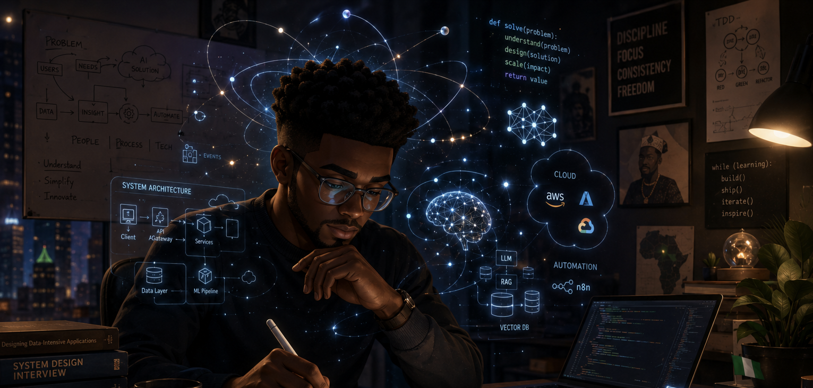

# Hi 👋, I'm James

### Solutions Engineer • AI • Machine Learning • Cloud • Generative AI • MLOps

  

## 👨‍💻 About Me

Building with AI, automation, and code to turn complex ideas into smart systems. I design intelligent cloud solutions, shape responsible AI, and lead teams that turn strategy into impact. Driven by one mission: use technology to make life better.

## 💻 Tech Stack

## 🌐 Connect with Me

## ⚡ Fun Fact

> "The best way to predict the future is to build it."

