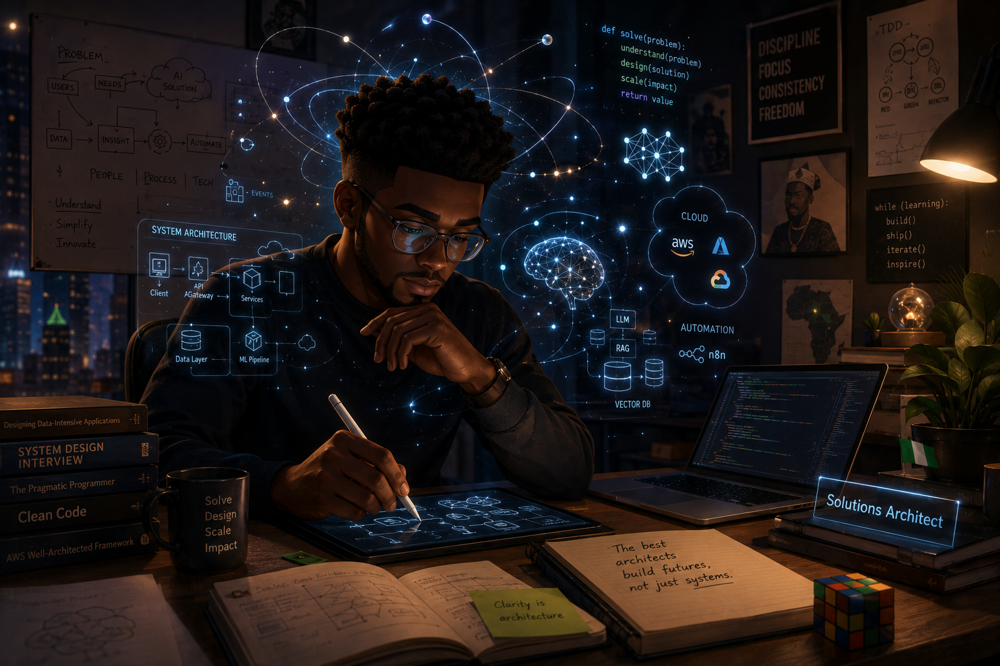

# James Agbonhese

### AI • Cloud • Machine Learning • Automation

☁️ Cloud & DevOps
AWS • Azure • Docker • Kubernetes

🧠 Interested in

- Generative AI
- Multimodal LLMs
- AI Agents
- MLOps
- Computer Vision
- Cloud Infrastructure

🚀 Currently Building

- AI Automation Platform
- RAG Applications
- Local LLM Infrastructure
- Medical AI Pipeline

📫 Reach me

LinkedIn:
https://linkedin.com/in/...

Portfolio:
https://...

Email:
...

<table>
<tr>
<td>

</td>

<td>

</td>
</tr>
</table>

<!-- Animated Header -->
<h1 align="center">
  Hi 👋, I'm James Agbonhese
</h1>

<h3 align="center">
AI Engineer • Machine Learning • Cloud • Generative AI • MLOps
</h3>

  

---

## 👨‍💻 About Me

🎓 Master's in Electrical & Computer Engineering @ Concordia University

🤖 AI Engineer specializing in Machine Learning, LLMs, Computer Vision, and Cloud Computing

☁️ Passionate about scalable AI systems, MLOps, and modern cloud infrastructure.

🌱 Currently learning

- Advanced LLM Engineering
- AI Agents
- RAG Systems
- Multimodal AI
- Kubernetes
- Distributed AI

🚀 Currently Building

- AI Automation Platform
- Medical AI Pipeline
- Local LLM Infrastructure
- RAG Applications

---

## 🌐 Connect with Me

---

## 💻 Tech Stack

---

## 📊 GitHub Stats

---

## 🔥 GitHub Streak

---

## 🏆 GitHub Trophies

---

## 📈 Contribution Graph

---

## 👀 Visitors

---

## 🚀 Featured Projects

🔹 AI Automation Platform

🔹 Medical AI Pipeline

🔹 Local LLM Infrastructure

🔹 Multimodal LLM Experiments

🔹 RAG Knowledge Assistant

🔹 Cloud-native AI Applications

---

## ⚡ Fun Fact

> "The best way to predict the future is to build it."

---

